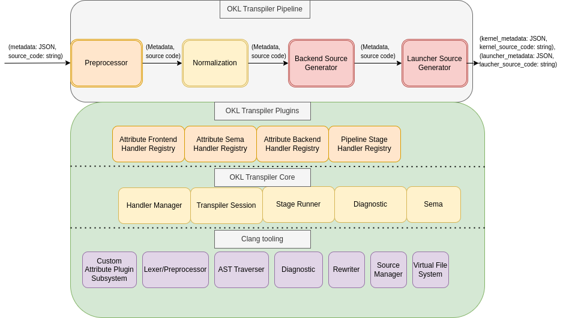
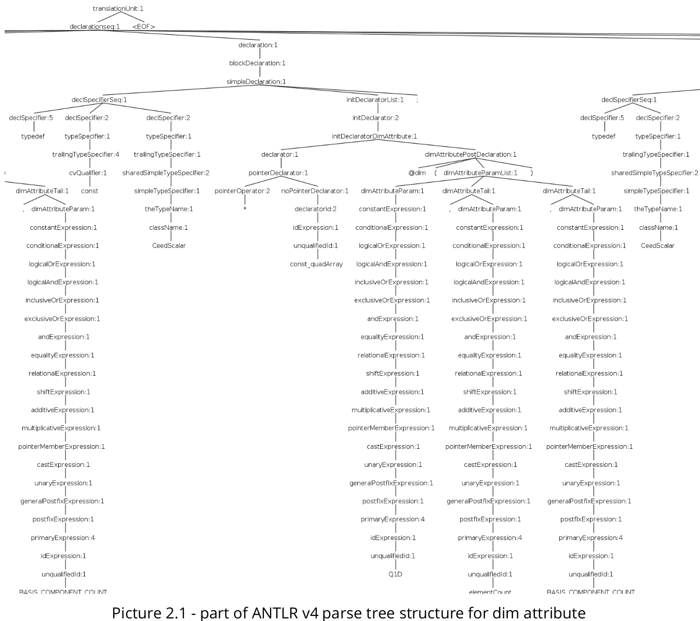

# New OKL Transpiler Overview
## Table of content
1. [Objective](#objective)
2. [High Level Design](#HLD)
3. [Features of the new OKL Transpiler](#features)
4. [Future steps](#future_steps)
5. [Appendix A - Alternative approaches ](#appendix_a)
6. [Appendix B - OKL specification ](#appendix_b)
<div style="page-break-after: always;"></div>

## Objective <a name="objective"></a>
Open Concurrent Compute Architecture (OCCA) acts as a broker amongst the most available
multi-threading APIs (CUDA, HIP, DPC++, OpenMP, OpenCL, pThreads, and Metal). Out of the
entire OCCA ecosystem, the OKL (OCCA Kernel Language) parser (translating OKL into one of the
various APIs) is its main weakness. The current OKL source-to-source compiler with annotations
needs to be rewritten using a parser generator that is available to the open-source community
and usable commercially.
The new OKL parser generator should satisfy the following criteria:
  - Support of C++ code for modern standard (C11, C++11, C++14, C++17);
  - Easy to extend with new functionalities: add syntactic sugar syntax, backend specific
attributes, generalized intrinsics;
  - Based on matures and a well-supported library/framework with good community
support;
  - integration with IDE and static code analyzer.
<div style="page-break-after: always;"></div>

## High Level Design <a name="HLD"></a>

The new OKL Transpiler designed as multi staged pipeline with AST-driven, string based translation using Clang frontend tooling.



The main features/goals of the Clang project are the following:
 - A real-world, production quality compiler
 - Support diverse clients (refactoring, static analysis, code generation, etc.)
 - A single unified parser for C, Objective C, C++, and Objective C++
 - Conformance with C/C++/ObjC and their variants
 - Modular library-based architecture
 - Expressive diagnostics
 - GCC & MSVC compatibility
 - Allow tight integration with IDEs

Due to Clang's Lexer and Parser could not be updated in plugin-based manner(without modifying
Clang source code base) to support user specific syntax and keywords.
To overcome this problem the normalization stage is proposed to transform OKL source code to
pure C++ source code by replacing OKL specific attributes with C/C++ attributes. After this
operation the performed, C++ source code remains with the same semantics as original and
could be easily parsed by Clang to produce AST for further analysis and transformations.

<div style="page-break-after: always;"></div>
Example of normalization stage:

Legacy OKL source code based on extension syntax
```cpp
@kernel void addVectors(const int entries, const float* a, const float* b, float* ab) {
    @outer for (int j = entries - 1; j >= 0; --j) {
        @inner for (int i = entries - 1; i >= 0; --i) {
            ab[i] = add(a[i], b[i]);
        }
    }
}
```
Normalized OKL source code based on pure C++ syntax
```cpp
[[okl_kernel("")]] void addVectors(const int entries, const float* a, const float* b, float* ab) {
    [[okl_outer("")]] for (int j = entries - 1; j >= 0; --j) {
        [[okl_inner("")]] for (int i = entries - 1; i >= 0; --i) {
            ab[i] = add(a[i], b[i]);
        }
    }
}
```

<div style="page-break-after: always;"></div>
After normalization the modified source code could be easily parsed into AST:


<div style="page-break-after: always;"></div>

Then OKL Transpiler performs a translation process we refer to as "AST-Driven, String Based
Translation". This process uses the AST generated by Clang to identify expressions of input source code that contain OKL attributes structures that need to be translated and validate semantic of the entire kernel. Once such expressions are
identified, the OKL Transpiler recurses into each of the individual components of the expression
to look for further sub-expression that may need translation. Once all sub-expressions are
checked, the OKL Transpiler performs highly localized string-based rewrites of the OKL attributes
to cosmetic or backend specific representation:
```cpp
#include <cuda_runtime.h>

extern "C" __global__ void _occa_addVectors_0(const int entries,
                                              const float *a,
                                              const float *b,
                                              float *ab) {
  {
    int j = (entries - 1) - blockIdx.x;
    {
      int i = (entries - 1) - threadIdx.x;
      ab[i] = add(a[i], b[i]);
    }
  }
}
```
<div style="page-break-after: always;"></div>

## Features of the new OKL Transpiler <a name="features"></a>
### Basic features
- [x] Fully compatible with legacy OCCA:
    - Existing projects based on legacy OCCA transpiler could migrate to the new transpiler by only specify which version of transpiler to use in runtime
- [x] Ported four main backends:
  - [x] - OpenMP
  - [x] - CUDA
  - [x] - HIP
  - [x] - DPCPP
  - [ ] - OpenCL
  - [ ] - Metal
### New features
- [x] Support of C++17 in OKL source code
- [x] Plugin based system to extend OKL frontend/backend/semantic:
  - The new OKL transpiler provides plugin system to easily add/update:
    -  OKL attribute frontend
    -  OKL attribute semantic in scope of declaration/statement
    -  OKL attribute semantic in scope of entire kernel
    -  backend implementation
    -  syntax/semantic error reporting
- [x] Plugin based system to extend/add/modify transpiler pipeline:
  - add/modify stage in pipeline;
  - add new pipeline
- [x] Pass specific compilation flags(Clang/GCC compatible) to transpiler(for example treat all warnings as error or support C++2x features)

<div style="page-break-after: always;"></div>

### Experimental features:
- [x] Built-in intrinsic to leverage benefits of specific backend in portable way. For example following OKL kernel:
```cpp
#include <okl_intrinsic.h>

@kernel void reductionWithSharedMemory(const int entries, const float *vec,
                                       float *blockSum) {
    // Partial reduction of vector using loop tiles of size block
    for (int group = 0; group < ((entries + block - 1) / block); ++group;
         @outer) {
        @shared float s_vec[block];
        for (int item = 0; item < block; ++item; @inner) {
            if ((group * block + item) < entries) {
                okl_memcpy_async(s_vec[item], vec[group * block + item],
                                 4);
                okl_pipeline_commit();
                okl_pipeline_wait_prior(0);
            } else {
                s_vec[item] = 0;
            }
        }
    }
}
```
will be transpiled into optimized CUDA kernel:
```cpp
extern "C" __global__
__launch_bounds__(256) void
_occa_reductionWithSharedMemory_0(const int entries,
                                  const float *vec,
                                  float *blockSum) {
  {
    int group = (0) + blockIdx.x;
    __shared__ float s_vec[256];
    {
      int item = (0) + threadIdx.x;
      if ((group * 256 + item) < entries) {
        __pipeline_memcpy_async(s_vec[item], vec[group * 256 + item], 4);
        __pipeline_commit();
        __pipeline_wait_prior(0);
      } else {
        s_vec[item] = 0;
      }
    }
  }
}
```
and regular HIP kernel with synchronous coping from global to shared memory

```cpp
#include <hip/hip_runtime.h>

extern "C" __global__
__launch_bounds__(256) void _occa_reductionWithSharedMemory_0(const int entries,
                                                              const float *vec,
                                                              float *blockSum) {
  {
    int group = (0) + blockIdx.x;
    __shared__ float s_vec[256];
    {
      int item = (0) + threadIdx.x;
      if ((group * 256 + item) < entries) {
        s_vec[item] = vec[group * 256 + item];
      } else {
        s_vec[item] = 0;
      }
    }
  }
}
```
<div style="page-break-after: always;"></div>

## Future steps <a name="future_steps"></a>
### Short term features
- [ ] Support templated OKL kernel to implicitly generate specific instantiation based on the type of input arguments for kernel. At this moment to have different instantiations of the same OKL kernel but for different data types: int32, int64, float16, float, double requires a lot of boilerplate codes mixed with macro hell.


Templated OKL kernel:
```cpp
template <typename T>
@kernel void addVectors(const int entries, const T *a, const T *b, T *ab) {
  for (int i = 0; i < entries; ++i; @tile(1, @outer, @inner)) {
    ab[i] = a[i] * b[i];
  }
}
```
OCCA host code
```cpp
  // transpile the kernel at run-time but do not compile because input types are unknown yet
  occa::kernel addVectors = device.buildKernel("addVectors.okl","addVectors");
  // Allocate memory on the device for float
  occa::memory d_a_f32 = device.malloc<float>(entries);
  occa::memory d_b_f32 = device.malloc<float>(entries);
  occa::memory d_ab_f32 = device.malloc(entries * sizeof(float));

  std::vector<float> a_f32  (entries);
  std::vector<float> b_f32  (entries);
  std::vector<float> ab_f32 (entries);

  // run for float
  // Copy memory to the device
  d_a_f32.copyFrom(a_f32.data());
  d_b_f32.copyFrom(b_f32.data());
  // compile(only on the first run) and launch device kernel for float
  addVectors(entries, d_a_f32, d_b_f32, d_ab_f32);
  // Copy result to the host
  d_ab_f32.copyTo(ab_f32);


  // Allocate memory on the device for double
  occa::memory d_a_f64 = device.malloc<double>(entries);
  occa::memory d_b_f64 = device.malloc<double>(entries);
  occa::memory d_ab_f64 = device.malloc(entries * sizeof(double));

  std::vector<double> a_f64  (entries);
  std::vector<double> b_f64  (entries);
  std::vector<double> ab_f64 (entries);

  // run for float
  // Copy memory to the device
  d_a_f64.copyFrom(a_f64.data());
  d_b_f64.copyFrom(b_f64.data());
  // compile(only on the first run) and launch device kernel for double
  addVectors(entries, d_a_f64, d_b_f64, d_ab_f64);
  // Copy result to the host
  d_ab_f64.copyTo(ab_f64);
```
- [ ] Extendable OKL intrinsic to allow user add/replace/modify intrinsic/built-in function in portable way.
- [ ] Use C++ syntax for OKL kernel.
  The new transpiler already allows user to pass as input normalized OKL source code and generates specific backend. Writing code directly in pure C++ syntax allows user to leverage her/his favorite IDE and to have static syntax code analyzer/highlight during developing process that improve user experience and give possibility to catch simple syntax errors in early stage. To automate the migration process new OKL Transpiler provide CLI tool to convert existing legacy OKL kernel into semantically equivalent pure C++ syntax variant.

  ### Long term feature
  #### Reverse transpilation
  - [ ] To speed up migration from backend specific backend to OKL or give possibility quicker port native kernel to OKL ones transpilation from native to OKL representation is very useful. However, the complexity of such transformation is in magnitude higher than direct transpilation. Moreover reverse transpilation is in times harder to generalize and more easier to have specific reverse transpilation for each backend.
  ### Clangd plugin for static code analyzer of OKL source code
  - [ ] A lot of simple and tricky(implicit type conversion) bugs could be caught during typing of OKL source code by static analyzer. Due to transpiler is based on Clang it is possible to have Clangd extension for OKL to analyzer semantic and provide hints in case of wrong using of OKL kernel on early stage before transpilation.

<div style="page-break-after: always;"></div>

## Appendix A - Alternative approaches <a name="appendix_a"></a>
### Antlr4

ANTLR v4 is a parser generator tool based on the Adaptive LL* parsing algorithm. ANTLR v4 uses
EBNF gramma syntax and allows to generate Lexer/Parser for different output languages like
Java, C++, C# etc. For each of the output languages there are also dependent runtime API.
ANTLR v4 also provides repository with the set of most common language grammar. For
generating lexer and parser ANTLRv4 expects 2 files with the corresponded definitions of lexer
rules and grammar. It generated classes for output language that are used for building parse
tree. It also can optionally generate visitors/observers for these objects. Based on the location of
each Parse tree object, accessing the original source code of node is possible.

### Tested approach
During the prototyping process, C++ standard grammar is used as the base for extending it with
the OKL attributes. The following extensions were made:
 - Extended Lexer rules to support specific OKL keywords
 - Added rules for parsing OKL syntax such as @kernel, @shared, @outer, @inner, @tile
 - Extended C++ parsing rules to support OKL parsing rules for different statements and
declarations
 - Autogenerate visitors for traversing the parse tree as the source-to-source builder
 - Added target transpiling by Visitor pattern for CUDA described attributes below

The basic idea for generating the targeted source code can be represented in the following steps:
1. traverse parsing tree till the node that contains the OKL subrule node
2. copy all the source code till this node to the output as is
3. Based on the parsed tree node with OKL subrule decide what code must be generated for
the corresponding OKL backend and append It to the output buffer
4. Continue traversing parse tree till the end
5. Copy the rest to the output if there is no need to make OKL injections or modifications

### Occurred problems
 - Operate directly on an autogenerated parse tree objects instead of simplified Abstract
Syntax tree (AST) objects, for instance it easier to have more meaningful AST object types
like `VariableDeclaration` or `TypdefDef` to be present in AST. In general, it increases
the decision complexity of analysis (picture 2.1)
 - Does not have ability to add custom types, descriptors to the parse tree nodes because
they are autogenerated and limited by the ANTLR syntax rules. For instance, it’s hard to
add the user-defined declaration context type to a specific parse rule object.
 - For generation, insertion or modifying original source needs extra implementation for
handling location, strings and other methods.
 - LL* algorithm of processing grammar introduces limitations on simplifying parser tree
itself.
 - The feature of non-deterministic OKL attributes in C/C++ grammar has not been
processed under the investigation. For instance, @outer, @inner attributes are expected
to appear as sub-expressions in round brackets of `for` statement only. @tile attribute
can be placed before `for` statement or as the tailed expression in round brackets of it.
To resolve this issue at the grammar level, the processing of OKL attributes must be
placed in more generic rules such as basic language expression and statements that we
are interested in. This problem also increases the complexity of implementation and
maintenance, requires deeper domain knowledge, reduces further extendibility.


### Conclusion
ANTLRv4 tools can auto-generate parser with limited flexibility of extending by user-defined
features and types. All analyzing steps are going through the visiting of the built parse tree. The
parse tree itself has overcomplexity that affects the implementation source-to-source code
generation task. Flexibility of OKL attributes occurrence is hard to solve by directly changing the
C/C++ grammar that also needs to handle complex cases. Using out of the box C++14 standard
grammar avoids the necessity of implementing non-trivial C++ grammar itself but also limits
usability of the modern C++ standards.

<div style="page-break-after: always;"></div>

## Bison
The most familiar tool for parser generation is bison. Usually, it also needs lexer generator such
as an old-well known flex. In nowadays there are better alternatives that are faster, automatically
support UFT-8/UTF-16 encoding, stream buffers etc. For this approach re-flex was chosen as
lexer generator (https://github.com/Genivia/RE-flex). Bison as the parse generator supports LALR
(1), LR (1), GLR parsing algorithm and can generate output code for pure C, C++ and Java. Bison
requires the grammar file as the input with user-defined type for each rule. It allows to achieve
the following advantages: build parse tree or AST, make parse-time verifications, modify AST
nodes on the fly depending on circumstances, define contexts for different node types.

### Tested Approach
Used tools:
 - reflex 3.5.0 - lexer generator
 - bison (GNU Bison) 3.8 - parser generator

The base idea under this approach is realign on the following:
1. Make the grammar changes for supporting OKL attributes
2. before processing input file provide the target code generation type for parser
3. At parse-time for OKL attributed AST nodes make the modification of AST in place by
provided backend(target)
4. If there is not enough information at parse-time use visitor pattern as the additional step
for modifying the AST
5. Build the source code directly from the modified AST only for interested nodes. The rest
part of the code can be copied as is to the output buffer

It’s well known that only GLR parser can handle C++ grammar due to the necessity of getting full
context. Based on this GLP algorithm is used for the main steps.
Main steps that were done under implementation:
 - reimplement lexer grammar from ANTLR v4 repository of C++ 14 standard with usage of
re-flex library
 - reimplement ANTLR v4 C++ 14 grammar for GLR parser skeleton
 - Implement AST node types for usage in bison grammar
 - Extend lexer with OKL keywords
 - Extend grammar with OKL attribute rules
 - Resolving grammar conflict (not finished)
 - Add class hierarchy for AST nodes with ability to extend the set by inheritance
 - Add unit testing for adopted C++ grammar (not finished)
 - Implement AST modifier depends on the target backend at parse-time
 - Implement AST code generator from special node types (OKL involved   )
### Conclusion
This approach relaxes the limitations of Antlr4. It adds a lot
of flexibility for building custom AST, adds ability for nodes modification or context definition,
and even moves some decision making at parse-time state. All of this simplifies the source-to-
source transpiling code generation but the main problem of directly depending on grammar is
still present. This fact also is present in chapter 2 and can be described by the following
statement: modification of C++ grammar to support OKL directly takes effects on the complexity and
extensibility, limits by concrete C++ standard (C++-14 for this approach) and requires deeper domain
knowledge of compiler tools.

<div style="page-break-after: always;"></div>

## Appendix B - OKL specification <a name="appendix_b"></a>

OCCA kernel language is an C++ code extension that adds attributes of `@name` format, but also supports clean c++ code with CXX11 attributes.
While OCCA aims to abstract device management, OKL aims to abstract the programming of devices.

## Attributes
There are two attributes styles:
- Original -- format: `@name(arguments)`
- Normalized -- CXX11 attribute, format: `[[name(arguments)]]`

### \@kernel / \[\[okl_kernel("")\]\]
**Description:**
Declares a function as `kernel` function that can run in parallel across multiple compute threads

**Syntax**:
- `@kernel` doesn't take any arguments

**Semantic**
- Applies to functions only
- Function must return void
- It is allowed to have multiple `@kernel` functions in the file, but there has to be at least one
- Each kernel has to have at least one `@outer` and one `@inner` loop

**Example**
~~~{.cpp}
@kernel void test_kernel() {
    // ...
}
~~~

### \@outer / \[\[okl_outer("")\]\]
**Description:**
Can be used only inside `@kernel` decorated functions. Decorates a `for` loop to be run in parallel across multiple compute threads. Declaration can be used to switch between `x`, `y` and `z` indexed synchronized compute threads on targets that support it, otherwise it has no effect. `@outer` loops corresponds to parallelization over `block` in CUDA and `workgroup` in OpenCL.

**Syntax**
- `@outer(<number>=0)`
- Number is axis and can be 0, 1 or 2 corresponding to x, y and z.
- Number is optional. If it's not specified, it is calculated automatically: starting with zero from the deepest `@inner` loop

**Semantic**
- Applies to `for` loop only
- There can't be more that 3 (x,y,z) nested `@outer` loops.
- Please refer to [kernel structure](#kernel-structure) section to find out about other `@outer` constraints/rules introduced by OKL semantics.

~~~{.cpp}
@kernel void test_kernel() {
    @outer for (int i = 0; i < 32; ++i) {
        @outer for (int i2 = 0; i2 < 10; ++i2) {
            // ...
        }
    }
    @outer(1) for (int i = 0; i < 32; ++i) {
        for (int i2 = 0; i2 < 10; ++i2) {
            for (int i2 = 0; i2 < 10; ++i2; @outer(1)) {
                // ...
            }
        }
    }
}
~~~

### \@inner / \[\[okl_inner("")\]\]
**Description:**
Can only be used inside `@outer` decorated loops. Decorates a `for` loop to be run in parallel across multiple compute threads for targets that support parallelizing inner loops. Declaration can be used to switch between `x`, `y` and `z` indexed synchronized compute threads on targets that support it, otherwise it has no effect. `@inner` loops corresponds to parallelization over `thread` in CUDA and `workitem` in OpenCL.

**Syntax**
- `@inner(<number>)`
- Number is axis and can be 0, 1 or 2 corresponding to x, y and z.
- Number is optional. If it's not specified, it is calculated automatically: starting with zero from the deepest `@inner` loop

**Semantic**
- Applies to `for` loop only
- There can't be more that 3 (x,y,z) nested `@inner` loops.
- Please refer to [kernel structure](#kernel-structure) section to find out about other `@outer` constraints introduced by OKL semantics.

**Example**
~~~{.cpp}
@kernel void test_kernel() {
    @outer for (int i = 0; i < 32; ++i) {
        @outer for (int i2 = 0; i2 < 32; ++i2) {
            for (int j = 0; j < 32; ++j; @inner) {
                // ...
            }
            for (int k = 0;  k < 32; ++k) {
                @inner(0) for (int j = 0; j < 32; ++j) {
                    // ...
                }
            }
        }
    }
}
~~~

### \@tile / \[\[okl_tile("")\]\]
**Description:**
Can be used only inside `@kernel` decorated functions. Decorates a `for` loop to be run in parallel across multiple compute threads in groups `<number>` sized. Optional arguments `<kword>` can only be @outer and @inner explaining how to parallelize loop across multiple compute threads. Last optional argument enables/disables a check for the tiles loops that prevents them from going over the loop scope. Check is enabled by default for all tiled loops.

Code below:
~~~{.cpp}
for (int i = 0; i < N; ++i; @tile(16, @outer, @inner, check=false)) {
  // work
}
~~~
Is equivalent to
~~~{.cpp}
for (int iTile = 0; iTile < N; iTile += 16; @outer) {
  for (int i = iTile; i < (iTile + 16); ++i; @inner) {
    if (i < N) {
      // work
    }
  }
}
~~~

**Syntax**
- `@tile(<number>, [<kword>], [<kword>], [check = bool])`
- First argument is tile size,
- Second and third argument is parallelization method of first (tile index) and second (0..tile_size) loops. If skipped, then no attribute is applies to the loop
- check=false/true. If true, then adds boundary check for index. If you know that loop size is divisible by tile size, you can skip this check. Default: true

**Semantic**
- Applies to `for` loops only
- Note that if you use @outer-@inner types, then you can't put any `@shared` or `@exclusive` variables that must be defined between `@outer` and `@inner` loops

**Example**
~~~{.cpp}
@kernel void test_kernel() {
    @tile(16, @outer, @outer, check=false) for (int i = 0; i < 32; ++i) {
        for (int j = 0; j < 32; ++j; @inner) {
            // ...
            @inner(0) for (int jj = 0; jj < 32; ++jj) {
                // ...
            }
        }
        for (int k = 0; k < 32; ++k) {
            @tile(4, @inner(1), @inner(0), check=true) for (int j = 0; j < 32; ++j) {
                // ...
            }
        }
    }
}
~~~

### \@max_inner_dims / \[\[okl_max_inner_dims("")\]\]
**Description:**
For backends that require launcher code, we must know sizes of @inner loops (sizes of x,y,z loops). Usually it is calculated from the code, but user can overwrite these values.

**Syntax**
- `@max_inner_dims(<number>, <number>, <number>)`
- Each number is a size of x, y and z axis, defauling to 1.

**Semantic**
- Applies to top-level `@outer` `for` loop only

**Example**
~~~{.cpp}
@kernel void test_kernel() {
    @outer for (int i = 0; i < 32; ++i; @max_inner_dims(32, 32, 64)) {
        @outer for (int i2 = 0; i2 < 32; ++i2) {
            @inner for (int j = 0; j < 32; ++j) {
                // ...
            }
            for (int k = 0; k < 32; ++k) {
                @inner for (int j = 0; j < 32; ++j) {
                    // ...
                }
            }
        }
    }

    @outer for (int i = 0; i < 32; ++i; @max_inner_dims(10, 10)) {
        @outer for (int i2 = 0; i2 < 32; ++i2) {
            @inner for (int j = 0; j < 10; ++j) {
                // ...
            }
            for (int k = 0; k < 32; ++k) {
                @inner for (int j = 0; j < 10; ++j) {
                    // ...
                }
            }
        }
    }
}

~~~

### \@dim / \[\[okl_dim("")\]\]
**Description:**
Transparently transforms variable or type declaration into a multi-indexed array. Variable of type attributed by `@dim` can be indexed with virtual operator() (see example)

**Syntax**
- `@dim(<expr>, <expr>...)`

**Semantic**
- Applies to type declaration or variable declaration.
- Value can be indexed with comma separated expressions in parenthesis: `int* mat34 @dim(3, 4)` -> `mat(0, 1+1) = 12`.
- Number of indecies when indecing must be the same as number of dimensions.

**Example**
~~~{.cpp}
typedef float* fmat10_10_t @dim(10, 10);

@kernel void test_kernel(int* mat34 @dim(3, 4), fmat10_10_t mat10_10) {
    @outer for (int i = 0; i < 32; ++i) {
        @outer for (int i2 = 0; i2 < 32; ++i2) {
            @inner for (int j = 0; j < 32; ++j) {
                mat34(i, i2) = j;
                mat10_10(i, j) = 1.0f / (i + j + 1);
            }
        }
    }
}
~~~


### \@dimOrder / \[\[okl_dimOrder("")\]\]
**Description:** Changes order of dimensions accepted by `@dim` decorated types and variables. Accepts at least one argument, and each parameter represents dimension index starting from 0 and must be unique.

**Syntax**
- `@dimOrder(<number>, <number>...)`

**Semantic**
- Applies to type or variable declarations. Type or variable must be attributed with `@dim`
- Number of arguments must be the same as number of dimensions in `@dim`

**Example**
~~~{.cpp}
typedef float* fmat10_10_10_t @dim(10, 10, 10);

@kernel void test_kernel(int* mat34 @dim(3, 4) @dimOrder(1, 0), fmat10_10_10_t mat10_10_10 @dimOrder(2, 0, 1)) {
    for (int i = 0; i < 32; ++i; @outer) {
        @outer for (int i2 = 0; i2 < 32; ++i2) {
            @inner for (int j = 0; j < 32; ++j) {
                mat34(i, i2) = j;
                mat10_10_10(i, j, i2) = 1.0f / (i + j + 1);
                state.velocity(1) = mat10_10_10(i, j, i2);
            }
        }
    }
}
~~~

### \@shared / \[\[okl_shared("")\]\]
**Description:**
The concept of shared memory is taken from the GPU programming model, where parallel threads/workitems can share data.
Adding the @shared attribute when declaring a variable type will allow the data to be shared across inner loop iterations.

**Syntax**
- `@shared` doesn't take any arguments

**Semantic**
- Applies to type declaration or variable declaration
- Variable with `@shared` attribute must be declared between `@outer` and `@inner` loops
- Variable must be a constant size array

**Example**
~~~{.cpp}
typedef float sh_float32_t @shared;

@kernel void test_kernel() {
    @outer for (int i = 0; i < 32; ++i) {
        @shared int a[32];
        sh_float32_t b[32];
        @inner for (int j = 0; j < 32; ++j) {
            a[j] = i + j;
            b[j] = a[j];
        }
    }
}
~~~


### \@exclusive / \[\[okl_exclusive("")\]\]
**Description:**
The concept of exclusive memory is similar to thread-local storage, where a single variable actually has one value per thread.
In our case, we create an instance of the variable per loop iteration instead of per thread.

**Syntax**
- `@exclusive` doesn't take any arguments

**Semantic**
- Applies to type declaration or variable declaration
- Variable with `@exclusive` attribute must be declared between `@outer` and `@inner` loops
- Variable must be a constant size array

**Example**
~~~{.cpp}
typedef float ex_float32_t @exclusive;

@kernel void test_kernel() {
    @outer for (int i = 0; i < 32; ++i) {
        @exclusive int c[32];
        ex_float32_t d[32];
        @inner for (int j = 0; j < 32; ++j) {
            c[j] = i+j;
            d[j] = i-j;
        }
    }
}
~~~


### \@atomic / \[\[okl_atomic("")\]\]
**Description:**
Atomic expression / compound statement decorator. Performs synchronized block/atomic operations across multiple compute threads. `@atomic` keyword can be applied to any expression and forces it to be performed atomically `@atomic` keyword can also be applied to compound statement.

**Syntax**
- `@atomic` doesn't take any arguments

**Semantic**
- Applies to expressions or compound statements
- Backend must support provided operation(s) to be performed atomically

**Example**
~~~{.cpp}
@kernel void test_kernel() {
    @outer for (int i = 0; i < 32; ++i) {
        @shared float shm[32];
        @inner for (int j = 0; j < 32; ++j) {
            @atomic shm[i*j] += 32;
            @atomic { // This wouldn't work on CUDA/HIP
                shm[i*j]++;
                j += 32;
            }
        }
    }
}
~~~


### \@restrict / \[\[okl_restrict("")\]\]
**Description:** Pointers marked with `@restrict` cannot point to overlapping memory regions. This restriction allows compiler to make better optimizations.

**Syntax**
- `@restrict` doesn't take any arguments

**Semantic**
- Applies to pointer in
  - Function parameter
  - Function return type
  - Variable declaration
  - Type declaration
  - Struct/Class field declaration

**Example**
~~~{.cpp}
typedef float* @restrict rfloat_t;

@restrict float* offset(@restrict float* A, int i, int j, int N) {
    return A + i * N + j;
}

@kernel void test_kernel(@restrict float* A, @restrict float* B, rfloat_t C, int N) {
    @outer for (int i = 0; i < 32; ++i) {
        @inner for (int j = 0; j < 32; ++j) {
            float* a = offset(A, i, j, N);
            float* b = offset(B, i, j, N);
            float* c = offset(C, i, j, N);
            *c = *a + *b;
        }
    }
}
~~~

### \@barrier / \[\[okl_barrier("")\]\]
**Description:**
Thread synchronization barrier.
Inserts a thread synchronization barrier into the target generated code

**Syntax**
- `@barrier` doesn't take any arguments

**Semantic**
- Applies to null statement (i.e. should be in separate line, and not apply to any specific statement or declaration)


**Example**
~~~{.cpp}
@kernel void test_kernel() {
    @outer for (int i = 0; i < 32; ++i) {
        @shared float shm[32];
        @inner for (int j = 0; j < 32; ++j) {
            @atomic shm[i*j] += 32;
        }
        @barrier;
    }
}
~~~


### \@nobarrier / \[\[okl_nobarrier("")\]\]
**Description:**
Thread de-synchronization loop decorator.
Disables barriers between @inner loops. As mentioned in [kernel structure](#loops-tree-structure), if `@shared` or `@exclusive` variable is used in loops, there is an implicit synchronization between top-level `@inner` loops. For optimization purposes user may want to turn that behaviour off. `@nobarrier` will turn off this synchronization after given `for` loop.

**Syntax**
- `@nobarrier` doesn't take any arguments

**Semantic**
- Applies to `for` statement

**Example**
~~~{.cpp}
@kernel void test_kernel() {
    @outer for (int i = 0; i < 32; ++i) {
        @shared float shm[32];
        @nobarrier @inner for (int j = 0; j < 32; ++j) {
            shm[i] = i;
        }
        @inner for (int j = 0; j < 32; ++j) {
            @atomic shm[i * j] += 32;
        }
    }
}
~~~

### \@simd_length / \[\[okl_simd_length("")\]\]
**Description:** DPCPP specific attribute, to add `[[intel::reqd_sub_group_size(N)]]` attribute to transpiled code

**Syntax**
- `@simd_length(<number>)`
- Number is a SIMD size

**Semantic**
- Applied to a top-level `@outer` `for` loop

**Example**
~~~{.cpp}
@kernel void test_kernel() {
    @outer for (int i = 0; i < 32; ++i; @simd_length(16)) {
        @inner for (int j = 0; j < 32; ++j) {
            // ..
        }
    }
}
~~~


## Kernel structure
### Loops tree structure
- There can't be more than 3 nested `@outer` and `@inner` loops (x,y,z axis)
- Tree from attributed loops has the following restrictions (These restrictions come from usual scheme of parallelization for heterogeneous systems (like in CUDA, HIP, OpenCL, etc.)):
  - All nodes on the same level have the same attribute
  - All tree leaves must be on the same level
  - Note: attributed loop tree consists only from attributed loops, meaning that regular loops can be everywhere, as long as attributed loops structure remains valid.
- Between top-level `@inner` loops there is an implicit synchronization (`@barrier`) if `@shared` or `@exclusive`variables are used inside. To turn it off, use `@nobarrier`
Without `@nobarrier`:
~~~{.cpp}
@kernel void test_kernel() {
    @outer for (int i = 0; i < 32; ++i) {
        @shared float shm[32];
        /*@nobarrier*/ for (int j = 0; j < 32; ++j; @inner) {
            shm[i] = i;
        }
        @inner for (int j = 0; j < 32; ++j) {
            @atomic shm[i * j] += 32;
        }
    }
}
~~~
Is transpiled to (CUDA backend):
~~~{.cpp}
extern "C" __global__ __launch_bounds__(32) void _occa_test_kernel_0() {
  {
    int i = 0 + blockIdx.x;
    __shared__ float shm[32];
    /*@nobarrier*/
    {
      int j = 0 + threadIdx.x;
      shm[i] = i;
    }
    __syncthreads();
    {
      int j = 0 + threadIdx.x;
      atomicAdd(&shm[i * j], 32);
    }
  }
}
~~~
With `@nobarrier` uncommented it is transpiled to (CUDA backend):
~~~{.cpp}
extern "C" __global__ __launch_bounds__(32) void _occa_test_kernel_0() {
  {
    int i = 0 + blockIdx.x;
    __shared__ float shm[32];
    {
      int j = 0 + threadIdx.x;
      shm[i] = i;
    }
    {
      int j = 0 + threadIdx.x;
      atomicAdd(&shm[i * j], 32);
    }
  }
}
~~~